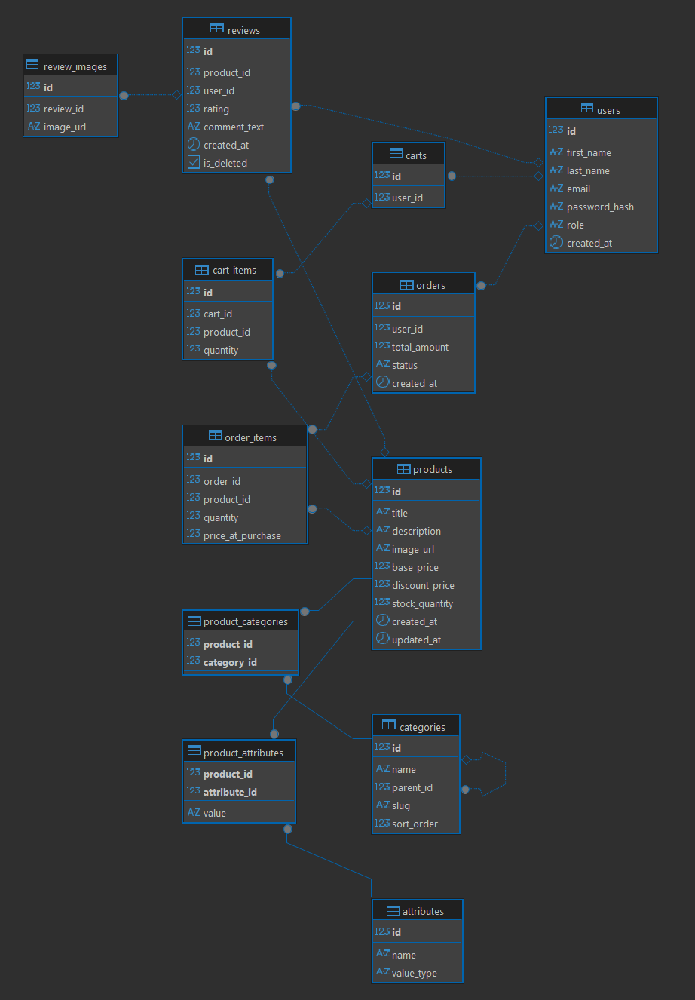

# Прототип Интернет-магазина

## Описание проекта 

Данный проект представляет собой backend веб-приложения интернет-магазина. Архитектура приложения соответствует современным стандартам.

## Технологический стек

### Backend
*   **Язык:** Java 8
*   **Фреймворк:** Spring Framework 5 (Spring Boot 2.7.x)
*   **Безопасность:** Spring Security 5 + JWT (JSON Web Tokens)
*   **ORM:** Hibernate / Spring Data JPA
*   **База данных:** PostgreSQL 15
*   **Сборка:** Maven
*   **Контейнеризация:** Docker & Docker Compose

## Функциональные возможности

1.  **Аутентификация и авторизация:**
    *   Регистрация новых пользователей.
    *   Вход в систему (Login) с выдачей JWT токена.
    *   Разграничение прав доступа (Роли: USER, ADMIN).
2.  **Каталог товаров:**
    *   Просмотр списка товаров.
    *   Фильтрация и поиск.
3.  **Корзина покупок:**
    *   Добавление/удаление товаров.
    *   Управление количеством позиций.
4.  **Заказы:**
    *   Оформление заказа.
    *   История заказов пользователя.
5.  **Администрирование (для роли ADMIN):**
    *   Управление товарами (CRUD).
    *   Просмотр всех заказов.

## База данных интернет-магазина 


## Запуск через Docker 

Проект полностью готов к запуску в изолированной среде. Все зависимости (БД, бэкенд) поднимаются одной командой.

1.  Убедитесь, что у вас установлен Docker Desktop.
2.  Откройте терминал в корне проекта.
3.  Выполните команду сборки и запуска:
    ```bash
    docker-compose up --build
    ```
4.  После успешного старта:
    *   **Backend API:** доступен по адресу `http://localhost:8080`
    *   **Database:** `localhost:5432` (DB: `electronics_store`, User: `postgres`, Pass: `111`).

### Проверка работоспособности в Docker
*   **Статус:** `docker ps` (контейнеры `shop_app` и `shop_db` должны быть в статусе `Up`).
*   **Логи:** `docker logs shop_app --tail 50` (ищите `Started Application`).
*   **Health Check:**
    ```powershell
    Invoke-WebRequest -Uri "http://localhost:8080/actuator/health"
    ```
*   **Проверка БД:**
    ```bash
    docker exec -it shop_db psql -U postgres -d electronics_store -c "\dt"
    ```

## Развёртывание и запуск в среде разработки (Local Development)

Инструкция для запуска проекта локально без Docker (в IDE).

### 1. Требования к ПО
*   **JDK 8** (Eclipse Temurin 8 или Oracle JDK 8). Проверка: `java -version`.
*   **Maven 3.6+**. Проверка: `mvn -v`.
*   **PostgreSQL 15+**. Сервер должен быть запущен.
*   **Node.js 16+** (для фронтенда).
*   **IDE:** IntelliJ IDEA (рекомендуется).

### Настройка базы данных (PostgreSQL)

#### Создание БД
Подключитесь к PostgreSQL (через `psql` или GUI) и выполните:
```sql
CREATE DATABASE electronics_store;
```
#### Инициализация схемы
Проект настроен на автоматическое создание таблиц при старте (`spring.jpa.hibernate.ddl-auto=update`).
*   При первом запуске Hibernate создаст таблицы (`users`, `products`, `cart` и др.) автоматически.
*   В проекте есть файл `src/main/resources/data.sql`, начальные данные загрузятся автоматически.

#### Конфигурация подключения
Откройте файл `src/main/resources/application.properties` и проверьте настройки:
```properties
spring.datasource.url=jdbc:postgresql://localhost:5432/electronics_store
spring.datasource.username=postgres
spring.datasource.password=111
spring.jpa.hibernate.ddl-auto=update
server.port=8080
```

#### Настройка JDK в IDE
1. В IntelliJ IDEA перейдите в меню: File -> Project Structure -> Project.
2. SDK: Выберите версию 1.8.
3. Language level: Установите 8 - Lambdas, type annotations etc..
4. В настройках компилятора Maven убедитесь, что Target bytecode version установлена в 8.

#### Запуск
* Запустите главный класс приложения src/main/java/org/example/_9javaspringjsvue/Application.java через IDE.
* Либо запуск через консоль
```bash
mvn clean spring-boot:run
```
Успешный старт: В логах должно появиться сообщение Started Application in ... seconds.